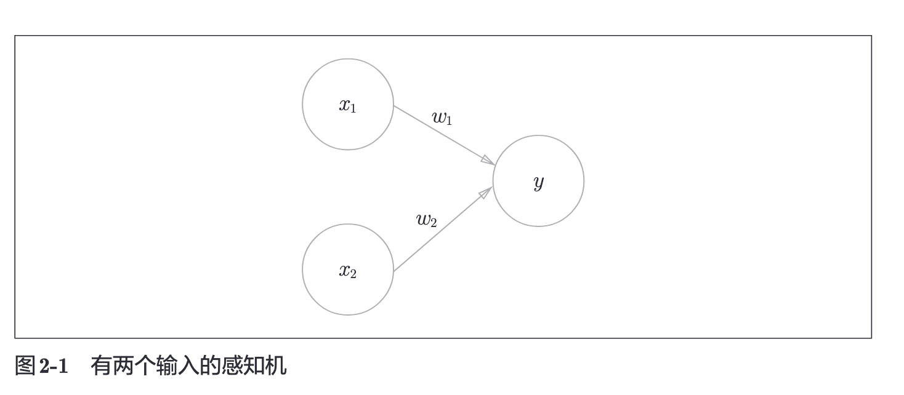
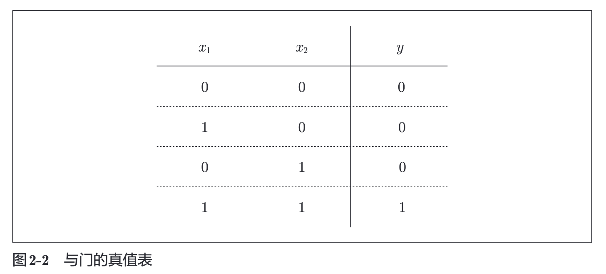
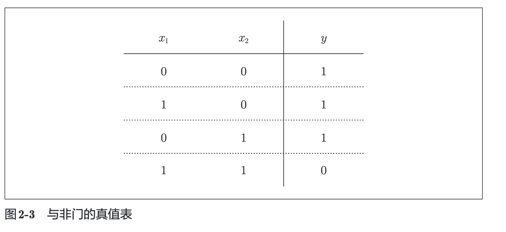
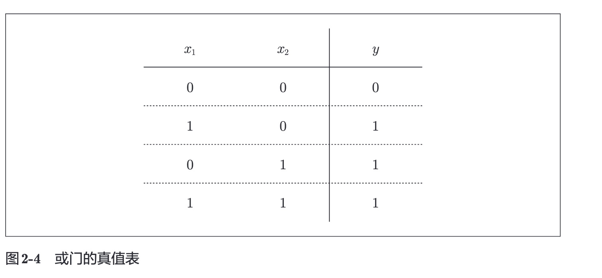

# 2.感知机

## 2.1感知机是什么

感知机接收多个输入信号，输出一个信号。本书中，`0`对应着不传递信号，`1`对应着传递信号。

上图中是一个接收两个输入信号的感知机的例子。$x^1、 x^2$是输入信号，$y$是输出信号，$w^1、 w^2$是权重，图中的圆圈成为`神经元`或者`节点`。输入信号被送往神经元时，会被分别乘以固定的权重$(w^1x^1, w^2x^2)$。神经元会计算传送过来的信号的总和，只有当这个总和超过了某个界限值时，才会输出1，这就是`神经元激活`。这里将这个界限的值称为`阈值`，使用符号$\theta$.

使用数学书来表示，即为：
$$
y = 
\begin{cases} 
0 & (w_1x_1 + w_2x_2 \leq \theta) \\ 
1 & (w_1x_1 + w_2x_2 > \theta) 
\end{cases}
$$

由公式不难看出，感知机的多个输入信号都有各自的权重，权重越大，对应该权重的信号的重要性就越高。

## 2.2简单逻辑电路

### 2.2.1 与门

### 2.2.2 与非门和或门

## 2.3感知机的实现

### 2.3.1 简单的实现

与门电路的实现：

    def AND(x1, x2):
        w1, w2, theta = 0.5, 0.5, 0.7
        tmp = x1*w1 + x2*w2
        if tmp <= theta:
            return 0
        elif tmp >= theta:
            return 1

与非电路的实现：

    def NAND(x1, x2):
        w1, w2, theta = 0.5, 0.5, 0.7
        tmp = x1*w1 + x2*w2
        if tmp >= theta:
            return 0
        elif tmp <= theta:
            return 1

或门电路的实现：

    def OR(x1, x2):
        w1, w2, theta = 0.5, 0.5, 0.7
        tmp = x1*w1 + x2*w2
        if tmp == 0 && tmp == 1
            return 0
        else:
            return 1

### 2.3.2 导入权重和偏置

可以对上面的$/theta$替换成$-b$, 将2.1中的数学公式修改为另一种形式。

$$

$$