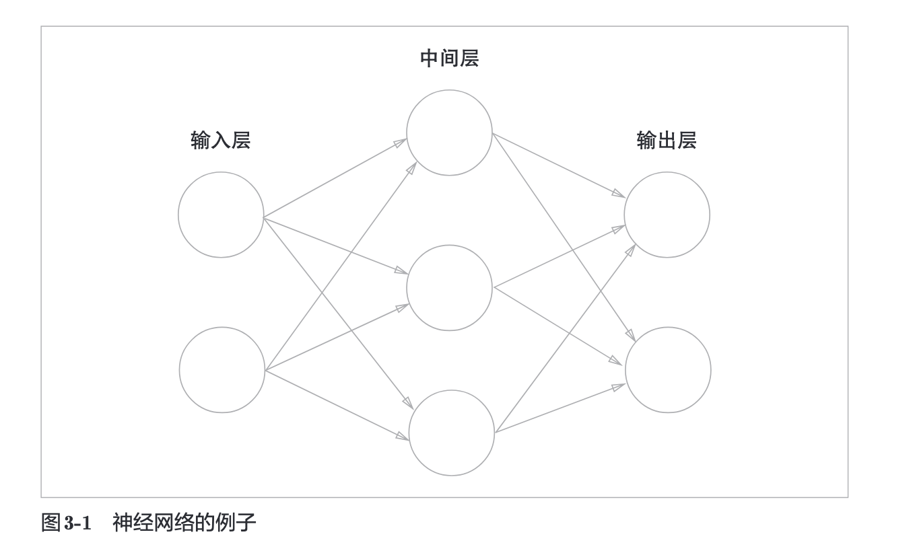

# 3 神经网络

## 3.1 从感知机到神经网络

神经网络与上一章的感知机有很多共同点。这里，我们主要以两者的差异为中心，来介绍神经网络的架构

### 3.1.1 神经网络的例子

我们将最左边的一列称为`输入层`，最右边的一列称为`输入层`，中间的一列称为`中间层`。

只看上图的话，我们不难发现与上一章的感知机并没有任何差异。

### 3.1.2 复习感知机

### 3.1.3 激活函数登场

